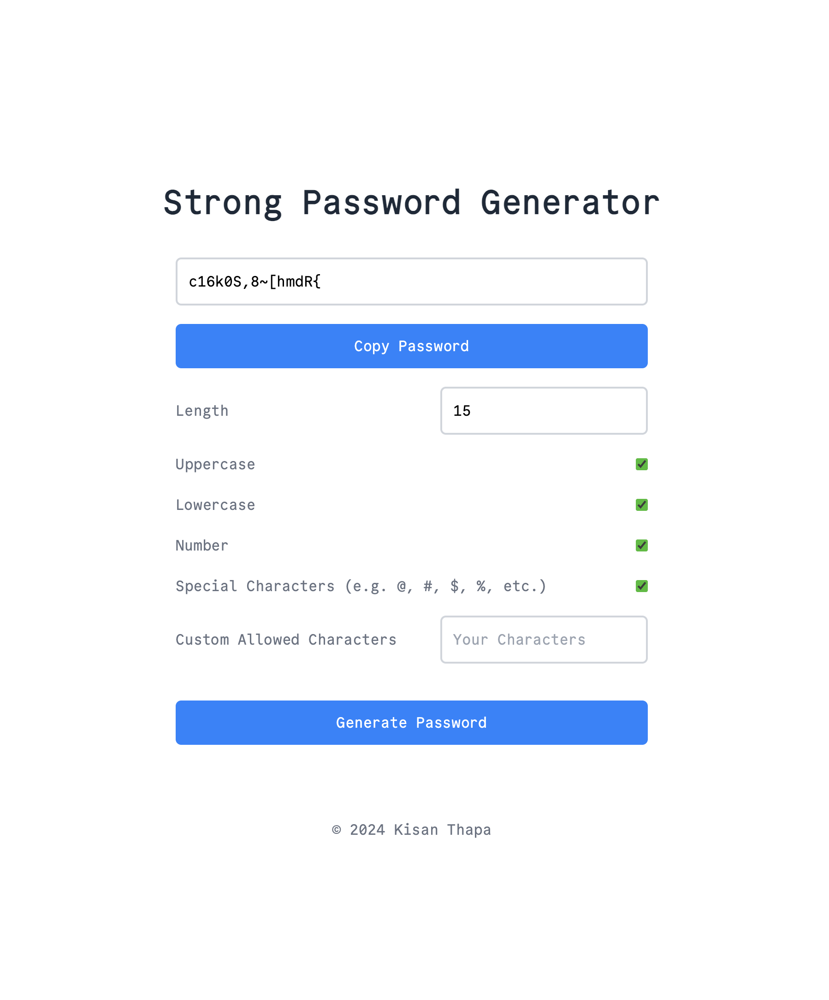

# Strong Password Generator

This is a simple password generator that generates a strong password based on the user's input. The user can specify the length of the password and the number of special characters to include in the password. The password is generated using a combination of uppercase and lowercase letters, numbers, and special characters. The user can also specify the number of passwords to generate.

## Image Sample



## Installation

Clone the repository and run the following command to install the required packages:

```bash
git clone https://github.com/KisanThapa/StrongPasswordGenerator.git
```

Open ```index.html``` in your browser to use the password generator.

